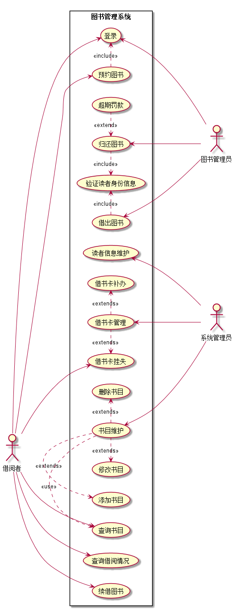
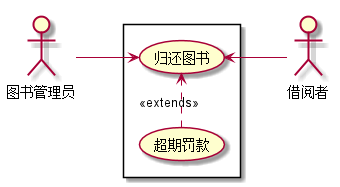
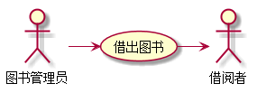

# 实验二：图书管理系统用例建模
### 姓名：王华港
### 班级：15软工2班
### 学号：201510414218
### GitHub地址：[git传送门](https://github.com/WangHuagang)
### 我的博客地址：[博客传送门](http://blog.54whg.cn)
- 博客中有关于git的基本命令操作的教程视频（PS：自己录制的） <b>[传送门](http://blog.54whg.cn/2018/04/01/gitLearnMovie/)</b>
>欢迎大家访问，有更好的建议和意见可以留言哦，或者在博客中在线联系我哦！

***
## ===以下为本次作业===
- - -
# 实验二：图书管理系统用例建模
## 1.图书管理系统的用例关系图
### 1.1用例图PlantUML源码如下：
    @startuml
    
    left to right direction
    :系统管理员: as SysAdmin
    :图书管理员: as Admin
    :借阅者: as User
    
    
    rectangle 图书管理系统{
    User --> (登录)
    User --> (查询借阅情况)
    User --> (预约图书)
    (预约图书).>(登录):<<include>>
    User --> (续借图书)
    User --> (查询书目)
    User --> (借书卡挂失)
    
    (借出图书).>(验证读者身份信息):<<include>>
    (借出图书) <-  Admin
    (验证读者身份信息)<.(归还图书):<<include>>
    (归还图书)<.(超期罚款):<<extend>>
    (归还图书) <- Admin
    (登录)<--- Admin
    
    (读者信息维护) <- SysAdmin
    (借书卡管理).>(借书卡补办):<<extends>>
    (借书卡管理) <- SysAdmin
    (借书卡挂失)<.(借书卡管理):<<extends>>
    (书目维护) <--- SysAdmin
    (书目维护).>(删除书目):<<extends>>
    (修改书目)<.(书目维护):<<extends>>
    (添加书目)<.(书目维护):<<extends>>
    (查询书目)<.(书目维护):<<use>>
    }
    
    @enduml
### 1.2用例图如下：


## 2.参与者说明
### 2.1 系统管理员
主要职责是：
- 维护工作包括图书的添加、删除和修改，书目的添加和删除，借阅者的添加、删除和修改。
- 系统管理员能够查询借阅者、图书和图书管理员的信息。
### 2.2 图书管理员
主要职责是：
- 对读者的借书、还书等操作进行处理。
- 帮助读者进行一些业务操作。
- 还书时若读者逾期应对其收取罚款。
### 2.3 借阅者
主要职责是：
- 可以通过查询图书并借取或者归还图书。
- 可查询自己的借阅情况。
- 若借记卡不慎丢失，可进行挂失并找系统管理员进行补卡操作。
- 按时还书，否则或造成逾期罚款。
## 3.用例规约表
### 3.1 "借出图书"用例
|Title | 内容 |
|:------:|:------:|
|用例名称|借出图书|  
|参与者|图书管理员（主要参与者）、借阅者（次要参与者）|
|前置条件|图书管理员已被识别和授权|
|后置条件|存储借书记录，更新库存数据，所借图书状态为借出|
|主事件流|1.图书管理员将读者借书卡提供给系统；<br>2.系统验证读者身份和借书条件；<br>3.图书管理员将读者所借图书输入系统；<br>4.系统记录借书信息，并且修改图书的状态和此书的可借数量；<br>5系统累加读者的借书数量；<br>6.重复3~5，直到图书管理员确认全部图书登记完毕；<br>7.系统打印借书清单，交易成功完成|
|备注|图书馆每本书都是可验证的|
 ### 3.2 "归还图书"用例
 |Title | 内容 |
 |:------:|:------:|
 |用例名称|归还图书|  
 |参与者|图书管理员（主要参与者）、借阅者（次要参与者）|
 |前置条件|图书管理员已被识别和授权|
 |后置条件|存储还书记录，更新库存数据，所借图书状态为未借出|
 |主事件流|
 1. 图书管理员将读者借书卡提供给系统；
 2. 系统验证读者身份和还书条件；
 3. 图书管理员将读者所借图书输入系统；
 4. 由系统计算出图书所借日期是否逾期，若逾期则需要借阅者缴纳逾期罚款；
 5. 系统记录还书信息，并且修改图书的状态和此书的可借数量；
 6. 系统打印还书清单，交易成功完成|
 |备注|还书须由图书管理员完成|

 ### 3.3“归还图书”用例流程图源码如下：
 ```
 @startuml
:图书管理员: as Admin
:借阅者: as User
left to right direction
rectangle {
Admin -->(归还图书)
(超期罚款).>(归还图书):<<extends>>
(归还图书) <--User
}
@enduml
 ```
### 3.3.1“归还图书”用例流程图如下：


### 3.4“借出图书”用例流程图源码如下：
 ```
 @startuml
:图书管理员: as Admin
:借阅者: as User
left to right direction
rectangle {
Admin -->(借出图书)<--User
}
@enduml
 ```
### 3.4.1“借出图书”用例流程图如下：
