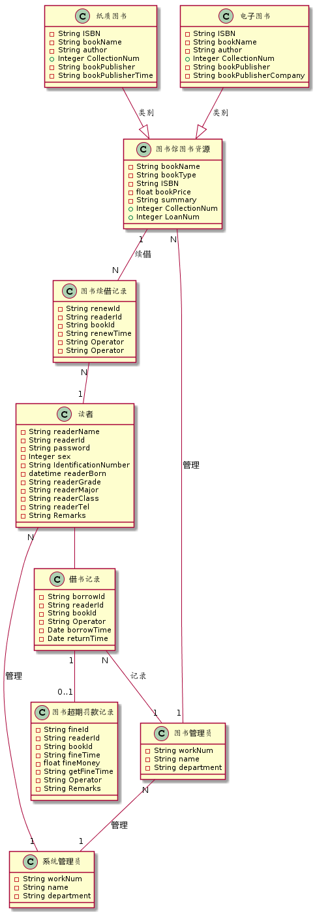
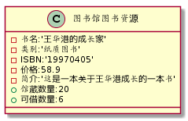
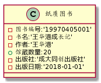
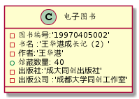
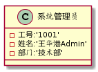
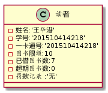
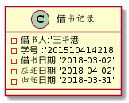
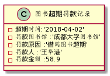
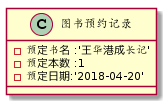

### 姓名：王华港
### 班级：15软工2班
### 学号：201510414218
### GitHub地址：[git传送门](https://github.com/WangHuagang)
### 我的博客地址：[博客传送门](http://blog.54whg.cn)
- 博客中有关于git的基本命令操作哦 <b>[传送门](http://blog.54whg.cn/2018/03/17/gitLearn/)</b>
>欢迎大家访问，有更好的建议和意见可以留言哦，或者在博客中在线联系我哦！

***
## ===以下为本次作业===
- - -

### 实验3：图书管理系统领域对象建模

### 1. 图书管理系统的类图

#### 1.1 类图PlantUML源码如下：
```
@startuml

class 图书馆图书资源{
    -String bookName
    -String bookType
    -String ISBN
    -float bookPrice
    -String summary
    +Integer CollectionNum
    +Integer LoanNum
}

class 纸质图书  {
    -String ISBN 
    -String bookName 
    -String author
    +Integer CollectionNum 
    -String bookPublisher
    -String bookPublisherTime
}
class 电子图书{
    -String ISBN 
    -String bookName 
    -String author
    +Integer CollectionNum 
    -String bookPublisher
    -String bookPublisherCompany 
    
}

class 系统管理员{
    -String workNum
    -String name
    -String department 
}
class 图书管理员{
    -String workNum
    -String name
    -String department 
}
class 读者{
    -String readerName
    -String readerId 
    -String password
    -Integer sex
    -String IdentificationNumber
    -datetime readerBorn
    -String readerGrade  
    -String readerMajor  
    -String readerClass  
    -String readerTel  
    -String Remarks  
}
class 借书记录{
    -String borrowId
    -String readerId 
    -String bookId
    -String Operator
    -Date borrowTime
    -Date returnTime
}
class 图书超期罚款记录 {
    -String fineId 
    -String readerId 
    -String bookId 
    -String fineTime 
    -float fineMoney 
    -String getFineTime 
    -String Operator 
    -String Remarks 
}

class 图书续借记录{
    -String renewId 
    -String readerId
    -String bookId 
    -String renewTime 
    -String Operator 
    -String Operator 

}


读者--借书记录
图书馆图书资源 "1"--"N"图书续借记录:续借
电子图书  --|> 图书馆图书资源:类别 
纸质图书 --|> 图书馆图书资源:类别 
图书续借记录"N"--"1"读者
读者"N"--"1"系统管理员:管理 
借书记录"N"--"1" 图书管理员:记录 
借书记录"1"--"0..1"图书超期罚款记录
图书管理员"N"--"1"系统管理员:管理
图书馆图书资源"N"--"1"图书管理员:管理 


@enduml
```

#### 1.2 类图如下：


#### 1.3 类图说明：
类图包括以下实体：
- 系统管理员
- 图书管理员
- 读者
- 纸质图书
- 电子图书
- 图书预约记录
- 图书超期罚款记录
- 以及各个实体的属性

### 2. 图书管理系统的对象图

#### 2.1 类[图书馆图书资源]的对象图
##### 源码如下：
```
@startuml

class 图书馆图书资源{
    -书名:'王华港成长记'
    -类别:'纸质图书'
    -ISBN:'19970405'
    -价格:58.9
    -简介:'这是一本关于王华港成长的一本书'
    +馆藏数量:20
    +可借数量:6
}

@enduml
```
##### 对象图如下：


#### 2.2 类[纸质图书]的对象图
##### 源码如下：
```
@startuml

class 纸质图书  {
    -图书编号:'19970405001'
    -书名:'王华港成长记'
    -作者:'王华港'
    +馆藏数量:20
    -出版社:'成大同创出版社'
    -出版日期:'2018-01-01'
}
@enduml
```
##### 对象图如下：


#### 2.3 类[电子图书]的对象图
##### 源码如下：
```
@startuml

class 电子图书{
    -图书编号:'19970405002'
    -书名 :'王华港成长记（2）'
    -作者:'王华港'
    +馆藏数量: 40
    -出版社:'成大同创出版社'
    -出版公司 :'成都大学同创工作室'
    
}
@enduml
```
##### 对象图如下：



#### 2.4 类[系统管理员]的对象图
##### 源码如下：
```
@startuml

class 系统管理员{
    -工号:'1001'
    -姓名:'王华港Admin'
    -部门:'技术部'
}
@enduml
```
##### 对象图如下：



#### 2.5 类[图书管理员]的对象图
##### 源码如下：
```
@startuml

class 系统管理员{
    -工号:'1001'
    -姓名:'王华港'
    -部门:'管理员'
}
@enduml
```
##### 对象图如下：


#### 2.6 类[读者]的对象图
##### 源码如下：
```
@startuml
class 读者{
    -姓名:'王华港'
    -学号:'201510414218'
    -一卡通号:'201510414218'
    -图书限额:10
    -已借图书数:7
    -超期图书数:0
    -罚款记录 :'无'
}
@enduml
```
##### 对象图如下：


#### 2.7 类[借书记录]的对象图
##### 源码如下：
```
@startuml
class 借书记录{
    -借书人:'王华港'
    -学号 :'201510414218'
    -借书日期:'2018-03-02'
    -应还日期:'2018-04-02'
    -归还日期:'2018-03-31'
}
@enduml
```
##### 对象图如下：


#### 2.8 类[图书超期罚款记录]的对象图
##### 源码如下：
```
@startuml
class 图书超期罚款记录 {
    -超期时间:'2018-04-02'
    -罚款图书馆 :'成都大学图书馆'
    -罚款原因 :'借阅图书超期'
    -罚款人 :'王华港'
    -罚款金额 :58.9
}
@enduml
```
##### 对象图如下：


#### 2.9 类[图书超期罚款记录]的对象图
##### 源码如下：
```
@startuml
class 图书预约记录{
    -预定书名 :'王华港成长记'
    -预定本数 :1
    -预定日期:'2018-04-20'
}
@enduml
```
##### 对象图如下：
