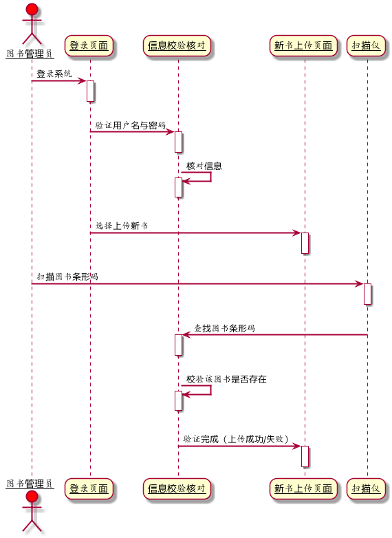
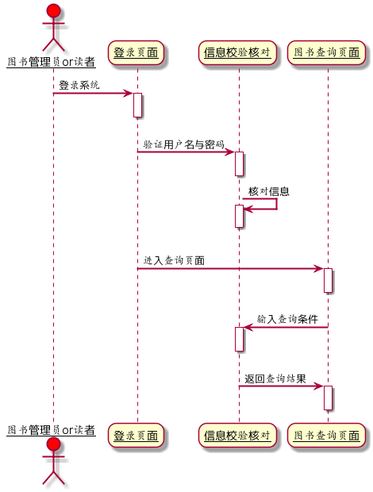
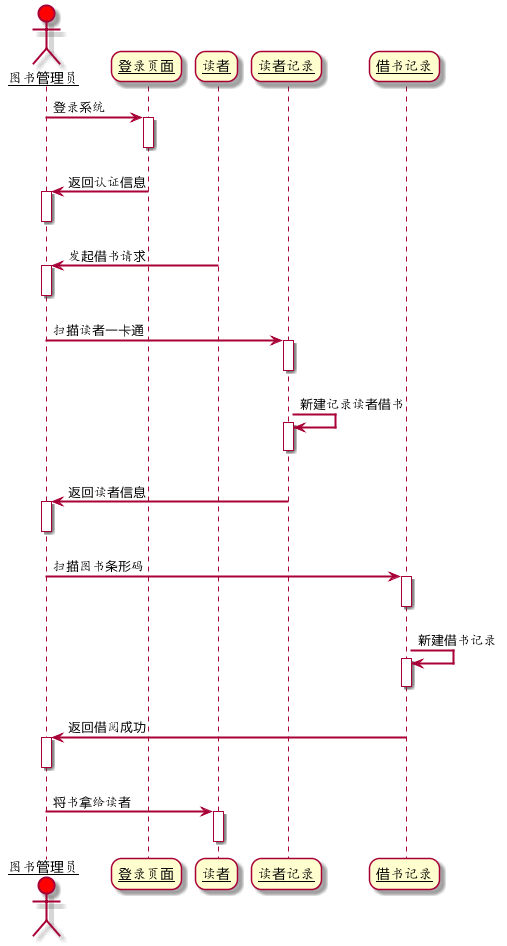
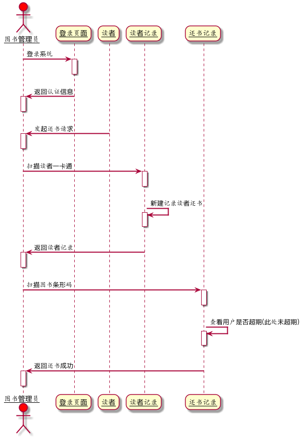
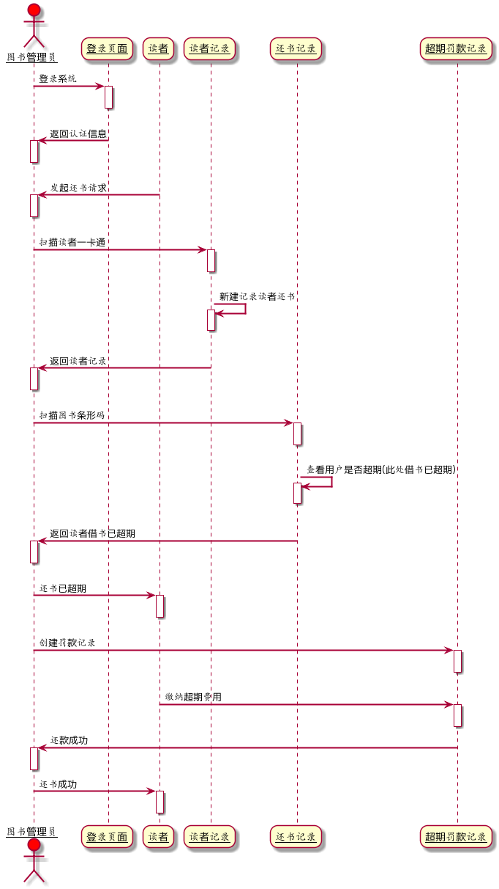
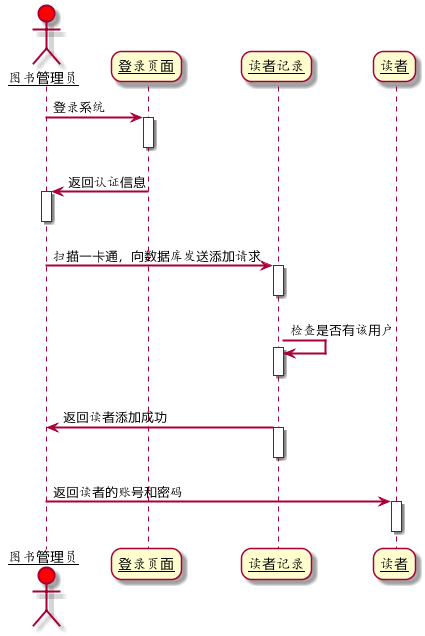
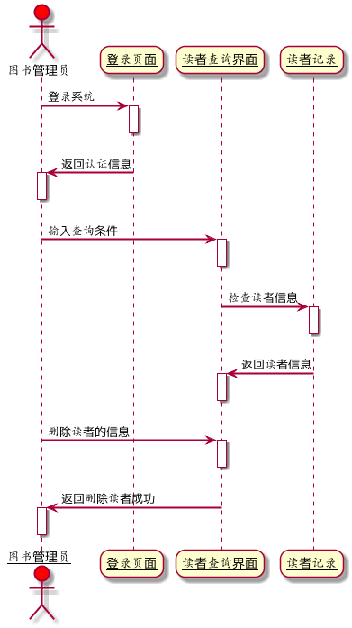
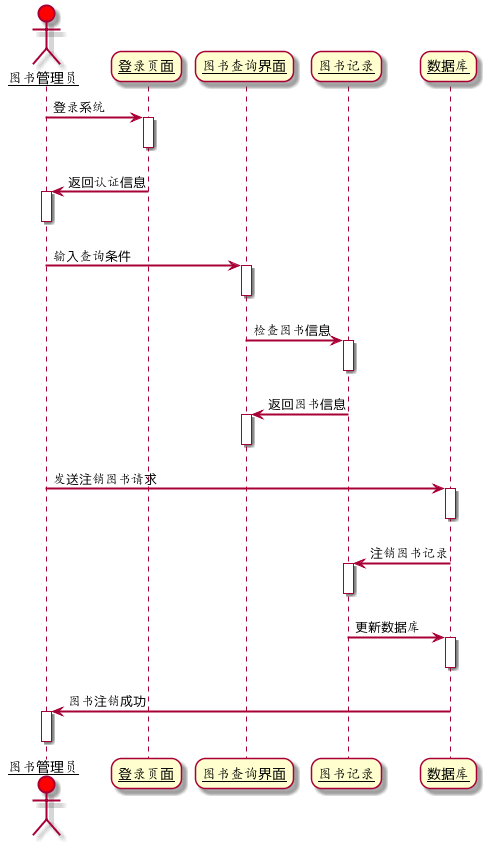

### 姓名：王华港
### 班级：15软工2班
### 学号：201510414218
### GitHub地址：[git传送门](https://github.com/WangHuagang)
### 我的博客地址：[博客传送门](http://blog.54whg.cn)
- 博客中有关于git的基本命令操作哦 <b>[传送门](http://blog.54whg.cn/2018/03/17/gitLearn/)</b>
>欢迎大家访问，有更好的建议和意见可以留言哦，或者在博客中在线联系我哦！

***
## ===以下为本次作业===
- - -

### 实验3：图书管理系统的顺序图

#### 1. 图书管理系统人员管理用例

##### 1.1 上传新书用例PlantUML源码
```
@startuml
skinparam sequenceArrowThickness 2
skinparam roundcorner 20
skinparam maxmessagesize 60
skinparam sequenceParticipant underline

actor 图书管理员 #red

图书管理员 -> 登录页面: 登录系统
activate 登录页面
deactivate 登录页面

登录页面 -> 信息校验核对: 验证用户名与密码
activate 信息校验核对
deactivate 信息校验核对

信息校验核对 -> 信息校验核对: 核对信息
activate 信息校验核对
deactivate 信息校验核对

登录页面->新书上传页面:选择上传新书
activate 新书上传页面
deactivate 新书上传页面

图书管理员->扫描仪:扫描图书条形码
activate 扫描仪
deactivate 扫描仪

扫描仪->信息校验核对:查找图书条形码
activate 信息校验核对
deactivate 信息校验核对

信息校验核对 -> 信息校验核对: 校验该图书是否存在
activate 信息校验核对
deactivate 信息校验核对

信息校验核对->新书上传页面:验证完成（上传成功/失败）
activate 新书上传页面
deactivate 新书上传页面
@enduml
```
##### 1.2 上传新书用例顺序图


##### 1.3 上传新书用例顺序图说明
本时序图包含了新书上传的这个过程，图书管理员登录系统，通过扫描仪进行扫描图书条形码，系统对条形码进行校验，系统中是否有这本书，从而反馈给系统管理员是否上传成功。

##### 2.1 查询图书用例PlantUML源码
```
@startuml
skinparam sequenceArrowThickness 2
skinparam roundcorner 20
skinparam maxmessagesize 60
skinparam sequenceParticipant underline

actor 图书管理员or读者 #red

图书管理员or读者 -> 登录页面: 登录系统
activate 登录页面
deactivate 登录页面

登录页面 -> 信息校验核对: 验证用户名与密码
activate 信息校验核对
deactivate 信息校验核对

信息校验核对 -> 信息校验核对: 核对信息
activate 信息校验核对
deactivate 信息校验核对

登录页面->图书查询页面:进入查询页面
activate 图书查询页面
deactivate 图书查询页面

图书查询页面->信息校验核对:输入查询条件
activate 信息校验核对
deactivate 信息校验核对

信息校验核对->图书查询页面:返回查询结果
activate 图书查询页面
deactivate 图书查询页面
@enduml
```
##### 2.2 查询图书用例顺序图

##### 2.3 查询图书用例顺序图说明
图书管理员或者读者可进行图书查询功能，为了方便将二者写在一个图里，其实读者无需登录也可以查询图书。

##### 3.1 借书用例PlantUML源码
```
@startuml
skinparam sequenceArrowThickness 2
skinparam roundcorner 20
skinparam maxmessagesize 60
skinparam sequenceParticipant underline

actor 图书管理员 #red

图书管理员 -> 登录页面: 登录系统
activate 登录页面
deactivate 登录页面

登录页面 -> 图书管理员: 返回认证信息
activate 图书管理员
deactivate 图书管理员

读者 -> 图书管理员: 发起借书请求
activate 图书管理员
deactivate 图书管理员

图书管理员->读者记录:扫描读者一卡通
activate 读者记录
deactivate 读者记录

读者记录->读者记录:新建记录读者借书
activate 读者记录
deactivate 读者记录

读者记录->图书管理员:返回读者信息
activate 图书管理员
deactivate 图书管理员

图书管理员->借书记录:扫描图书条形码
activate 借书记录
deactivate 借书记录

借书记录->借书记录:新建借书记录
activate 借书记录
deactivate 借书记录

借书记录->图书管理员:返回借阅成功
activate 图书管理员
deactivate 图书管理员

图书管理员->读者:将书拿给读者
activate 读者
deactivate 读者
@enduml
```
##### 3.2 借书用例顺序图

##### 3.3 借书用例顺序图说明
图书管理员首先需要对读者的信息进行查看，并为其创建一条借书记录。然后扫描图书的条形码，创建一条新的借书记录，最后将书籍返回给读者，借书成功。

##### 4.1 还书用例（未超期）PlantUML源码
```
@startuml
skinparam sequenceArrowThickness 2
skinparam roundcorner 20
skinparam maxmessagesize 60
skinparam sequenceParticipant underline

actor 图书管理员 #red

图书管理员 -> 登录页面: 登录系统
activate 登录页面
deactivate 登录页面

登录页面 -> 图书管理员: 返回认证信息
activate 图书管理员
deactivate 图书管理员

读者 -> 图书管理员: 发起还书请求
activate 图书管理员
deactivate 图书管理员

图书管理员->读者记录:扫描读者一卡通
activate 读者记录
deactivate 读者记录

读者记录->读者记录:新建记录读者还书
activate 读者记录
deactivate 读者记录

读者记录->图书管理员:返回读者记录
activate 图书管理员
deactivate 图书管理员

图书管理员->还书记录:扫描图书条形码
activate 还书记录
deactivate 还书记录

还书记录->还书记录:查看用户是否超期(此处未超期)
activate 还书记录
deactivate 还书记录

还书记录->图书管理员:返回还书成功
activate 图书管理员
deactivate 图书管理员
@enduml
```
##### 4.2 还书用例（未超期）顺序图

##### 4.3 还书用例（未超期）顺序图说明
图书馆管理员首先要验证改本图书是否超期，此处的还书是<strong>未超期</strong>的情况，未超期的话，直接创建还书记录即可还书成功。

##### 5.1 还书用例（已超期）顺序图
```
@startuml
skinparam sequenceArrowThickness 2
skinparam roundcorner 20
skinparam maxmessagesize 60
skinparam sequenceParticipant underline

actor 图书管理员 #red

图书管理员 -> 登录页面: 登录系统
activate 登录页面
deactivate 登录页面

登录页面 -> 图书管理员: 返回认证信息
activate 图书管理员
deactivate 图书管理员

读者 -> 图书管理员: 发起还书请求
activate 图书管理员
deactivate 图书管理员

图书管理员->读者记录:扫描读者一卡通
activate 读者记录
deactivate 读者记录

读者记录->读者记录:新建记录读者还书
activate 读者记录
deactivate 读者记录

读者记录->图书管理员:返回读者记录
activate 图书管理员
deactivate 图书管理员

图书管理员->还书记录:扫描图书条形码
activate 还书记录
deactivate 还书记录

还书记录->还书记录:查看用户是否超期(此处借书已超期)
activate 还书记录
deactivate 还书记录

还书记录->图书管理员:返回读者借书已超期
activate 图书管理员
deactivate 图书管理员

图书管理员->读者:还书已超期
activate 读者
deactivate 读者

图书管理员->超期罚款记录:创建罚款记录
activate 超期罚款记录
deactivate 超期罚款记录

读者->超期罚款记录:缴纳超期费用
activate 超期罚款记录
deactivate 超期罚款记录

超期罚款记录->图书管理员:还款成功
activate 图书管理员
deactivate 图书管理员

图书管理员->读者:还书成功
activate 读者
deactivate 读者
@enduml
```
##### 5.2 还书用例（已超期）顺序图

##### 5.3 上还书用例（已超期）顺序图说明
此处的读者还书的时候图书已超期，系统管理员进行验证，发现读者已超期，将创建新的超期记录，并告知读者已超期，不能还书成功。读者进行缴纳超期的费用，即可还书成功。

##### 6.1 添加读者用例PlantUML源码
```
@startuml
skinparam sequenceArrowThickness 2
skinparam roundcorner 20
skinparam maxmessagesize 60
skinparam sequenceParticipant underline

actor 图书管理员 #red

图书管理员 -> 登录页面: 登录系统
activate 登录页面
deactivate 登录页面

登录页面 -> 图书管理员: 返回认证信息
activate 图书管理员
deactivate 图书管理员

图书管理员 -> 读者记录: 扫描一卡通，向数据库发送添加请求
activate 读者记录
deactivate 读者记录

读者记录->读者记录:检查是否有该用户
activate 读者记录
deactivate 读者记录

读者记录->图书管理员:返回读者添加成功
activate 读者记录
deactivate 读者记录

图书管理员->读者:返回读者的账号和密码
activate 读者
deactivate 读者
@enduml
```
##### 6.2 添加读者用例顺序图

##### 6.3 添加读者用例顺序图说明
系统管理员添加读者，在添加之前需要先验证数据库中是否有改读者的信息，若没有便可以添加读者的信息，并返回读者注册成功的信息。

##### 7.1 删除读者用例PlantUML源码
```
@startuml
skinparam sequenceArrowThickness 2
skinparam roundcorner 20
skinparam maxmessagesize 60
skinparam sequenceParticipant underline

actor 图书管理员 #red

图书管理员 -> 登录页面: 登录系统
activate 登录页面
deactivate 登录页面

登录页面 -> 图书管理员: 返回认证信息
activate 图书管理员
deactivate 图书管理员

图书管理员 -> 读者查询界面: 输入查询条件
activate 读者查询界面
deactivate 读者查询界面

读者查询界面->读者记录:检查读者信息
activate 读者记录
deactivate 读者记录

读者记录->读者查询界面:返回读者信息
activate 读者查询界面
deactivate 读者查询界面

图书管理员->读者查询界面:删除读者的信息
activate 读者查询界面
deactivate 读者查询界面

读者查询界面->图书管理员:返回删除读者成功
activate 图书管理员
deactivate 图书管理员
@enduml
```
##### 7.2 删除读者用例顺序图

##### 7.3 上删除读者用例顺序图说明
系统管理员删除读者之前，向数据库发送请求验证读者信息，最终返回删除读者成功。

##### 8.1 注销图书用例PlantUML源码
```
@startuml
skinparam sequenceArrowThickness 2
skinparam roundcorner 20
skinparam maxmessagesize 60
skinparam sequenceParticipant underline

actor 图书管理员 #red

图书管理员 -> 登录页面: 登录系统
activate 登录页面
deactivate 登录页面

登录页面 -> 图书管理员: 返回认证信息
activate 图书管理员
deactivate 图书管理员

图书管理员 -> 图书查询界面: 输入查询条件
activate 图书查询界面
deactivate 图书查询界面

图书查询界面->图书记录:检查图书信息
activate 图书记录
deactivate 图书记录

图书记录->图书查询界面:返回图书信息
activate 图书查询界面
deactivate 图书查询界面

图书管理员->数据库:发送注销图书请求
activate 数据库
deactivate 数据库

数据库->图书记录:注销图书记录
activate 图书记录
deactivate 图书记录

图书记录->数据库:更新数据库
activate 数据库
deactivate 数据库

数据库->图书管理员:图书注销成功
activate 图书管理员
deactivate 图书管理员
@enduml
```
##### 8.2 注销图书用例顺序图

##### 8.3 注销图书用例顺序图说明
若图书已过时或者图书已丢失，需要注销图书。图书管理员向后台发送注销图书的请求，验证图书的信息，从而删除图书，并更新数据库。