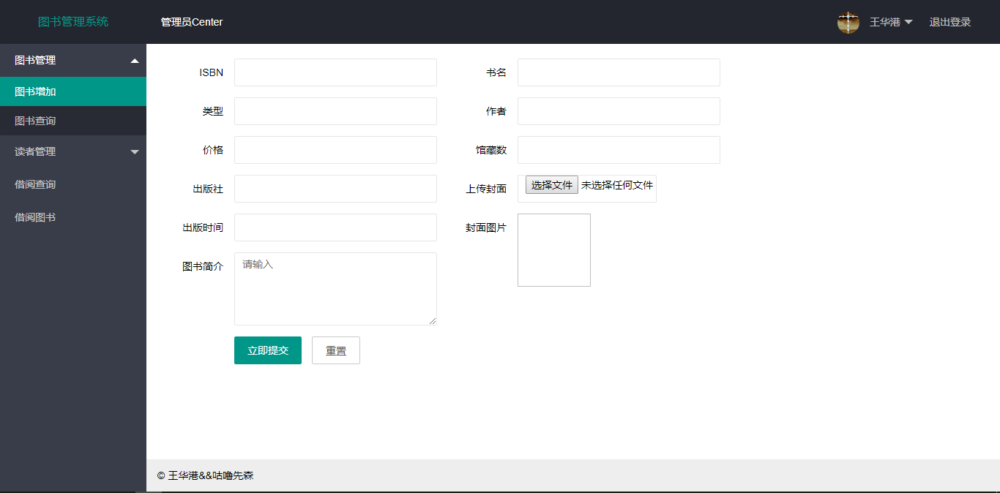
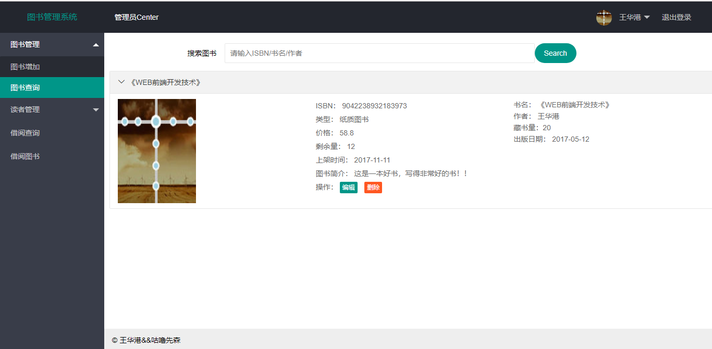

### 姓名：王华港
### 班级：15软工2班
### 学号：201510414218
### GitHub地址：[git传送门](https://github.com/WangHuagang)
### 我的博客地址：[博客传送门](http://blog.54whg.cn)
- 博客中有关于git的基本命令操作哦 <b>[传送门](http://blog.54whg.cn/2018/03/17/gitLearn/)</b>
>欢迎大家访问，有更好的建议和意见可以留言哦，或者在博客中在线联系我哦！

***
## ===以下为本次作业===
- - -
### 1.表数据库设计

**1.1 图书馆图书资源表**

|字段|类型|主键，外键|可以为空|约束|说明|
|:-------:|:-------------:|:------:|:----:|:---:|:-----|    
|bookName|varchar(100)|主键|否||书名|  
|bookType|varchar(50)| |否||图书的类别|
|ISBN|varchar(50)| |否||图书编号|  
|bookPrice|float(50)| |否||价格|
|summary|varchar(150)| |否||图书简介|  
|CollectionNum|int(200)| |否||馆藏数量|  
|LoanNum|int(100)| |是||可借数量|


**1.2 纸质图书表**

|字段|类型|主键，外键|可以为空|约束|说明|
|:-------:|:-------------:|:------:|:----:|:---:|:-----|    
|ISBN|varchar(100)|主键|否|||  
|bookName|varchar(50)| |否||书名|
|bookAuthor|varchar(50)| |否||作者|  
|CollectionNum|int(200)| |否||馆藏数量|  
|bookPublisher|varchar(50)| |否||出版社|
|bookPublisherTime|datetime(50)| |否||出版时间|  


**1.3 电子图书表**

|字段|类型|主键，外键|可以为空|约束|说明|
|:-------:|:-------------:|:------:|:----:|:---:|:-----|    
|ISBN|varchar(100)|主键|否|||  
|bookName|varchar(50)| |否||书名|
|bookAuthor|varchar(50)| |否||作者|  
|CollectionNum|int(200)| |否||馆藏数量|  
|bookPublisher|varchar(50)| |否||出版社|
|bookPublisherCompany|datetime(50)| |否||出版公司|  

**1.4 系统管理员表**

|字段|类型|主键，外键|可以为空|约束|说明|
|:-------:|:-------------:|:------:|:----:|:---:|:-----|    
|workNum|varchar(100)|主键|否||工号|  
|name|varchar(50)| |否||姓名|
|department|varchar(50)| |否||所属的部门|  

**1.5 图书管理员表**

|字段|类型|主键，外键|可以为空|约束|说明|
|:-------:|:-------------:|:------:|:----:|:---:|:-----|    
|workNum|varchar(100)|主键|否||工号|  
|name|varchar(50)| |否||姓名|
|department|varchar(50)| |否||所属的部门|  

**1.6 读者表**

|字段|类型|主键，外键|可以为空|约束|说明|
|:-------:|:-------------:|:------:|:----:|:---:|:-----|    
|readerId|varchar(100)|主键|否||借阅证号|
|readerName|varchar(100)| |否||读者姓名|  
|password|varchar(20)| |否||密码|
|sex|varchar(100)| |否||性别|
|IdentificationNumber|varchar(100)| |否||证件号码|  
|readerBorn|datetime(100)| |否||出生日期|
|readerGrade|varchar(100)| |否||年级|  
|readerMajor|varchar(100)| |否||专业|
|readerClass|varchar(100)| |否||班级|  
|readerTel|varchar(100)| |否||联系方式|  
|Remarks|varchar(100)| |否||备注|  

**1.7 借书记录表**

|字段|类型|主键，外键|可以为空|约束|说明|
|:-------:|:-------------:|:------:|:----:|:---:|:-----|    
|borrowId|varchar(20)|主键|否||借阅编号|
|readerId|varchar(20)|外键|否||读者编号|  
|bookId|varchar(20)|外键|否||图书编号|
|Operator|varchar(20)| |否||操作人员|  
|borrowTime|datetime(20)| |否||借阅时间|
|returnTime|datetime(20)| |否||归还时间| 

**1.8 图书超期罚款记录表**

|字段|类型|主键，外键|可以为空|约束|说明|
|:-------:|:-------------:|:------:|:----:|:---:|:-----|    
|fineId|varchar(100)|主键|否||超期罚款编号|
|readerId|varchar(20)|外键|否||读者编号|  
|bookId|varchar(20)|外键|否||图书编号|
|fineTime|datetime(100)| |否||罚款时间|  
|fineMoney|float(10)| |否||罚款金额|
|getFineTime|datetime(100)| |否||缴费时间|  
|Operator|varchar(20)| |否||操作人员|  
|Remarks|varchar(100)| |否||备注|  

**1.9 续借表**

|字段|类型|主键，外键|可以为空|约束|说明|
|:-------:|:-------------:|:------:|:----:|:---:|:-----|    
|renewId|varchar(100)|主键|否||续借编号|
|readerId|varchar(20)|外键|否||读者编号|  
|bookId|varchar(20)|外键|否||图书编号|
|renewTime|datetime(100)| |否||续借日期|  
|Operator|varchar(20)| |否||操作人员|  
|Remarks|varchar(100)| |否||备注|  

### 2. 界面设计

### 2.1. 添加图书界面设计

- 用例图参见：添加图书用例
- 类图参见：图书类
- 顺序图参见：添加图书顺序图
- API接口如下：

1. 添加图书信息

- 功能：用于提交图书信息
- 请求地址： http://54whg.cn:3000/api/addBook (可点击查看，但数据为模拟的数据，未从数据库中查询)
- 请求方法：get
- 请求参数：

|参数名称|必填|说明|
|:-------:|:-------------: | :----------:|
|ISBN|是|用于添加图书的唯一编号 |
|bookName|是|用于添加图书的书名|
|bookAuthor|是|用于添加图书的作者|
|bookPublisher|是|用于添加图书的出版社|
|bookPrice|是|用于添加图书的价格|
|bookPageNum|是|用于添加图书的页码|
|bookIntroduction|是|用于添加图书的简介|
|onTheShelfTime|是|用于添加图书的上架时间|
|bookPhoto|是|用于添加图书的封面|
|method|是|get|

- 返回实例：
```
{
    "info": "图书添加成功。",
    "code": 1001
}
```
- 返回参数说明：
    
|参数名称|说明|
|:-------:|:-------------: |
|Info|返回信息|
|code|返回码|

### 2.2 查询图书界面设计

- 用例图参见：查询图书用例
- 类图参见：图书类
- 顺序图参见：查询图书顺序图
- API接口如下：

1. 添加图书信息

- 功能：用于提交图书信息
- 请求地址： http://54whg.cn:3000/api/searchBook  (可点击查看，但数据为模拟的数据，未从数据库中查询)
- 请求方法：POST
- 请求参数：

|参数名称|必填|说明|
|:-------:|:-------------: | :----------:|
|ISBN|是|用于添加图书的唯一编号 |
|method|是|POST|

- 返回实例：
```
{
    "info": "图书添加成功。",
    "data": {
        "ISBN": "983028273218923",
        "bookName": "《WEB前端开发技术》",
        "bookAuthor": "王华港",
        "bookPublisher": "成都大学同创出版社",
        "bookPrice": "59.8",
        "bookPageNum": "399",
        "bookIntroduction": "这是一本神奇的书。",
        "onTheShelfTime": "2018-01-02 19:12:20",
        "photo": "http://54whg.cn/bookPhoto/983028273218923.png",
    },
    "code": 1001
}
```
- 返回参数说明：
    
|参数名称|说明|
|:-------:|:-------------: |
|Info|返回信息|
|data|返回图书的信息|
|code|返回码|


### 2.3 添加读者界面设计
- 用例图参见：添加读者用例
- 类图参见：读者类
- 顺序图参见：添加读者顺序图
- API接口如下：

1. 添加图书信息

- 功能：用于提交读者的信息
- 请求地址： http://54whg.cn:3000/api/addReader  (可点击查看，但数据为模拟的数据，未从数据库中查询)
- 请求方法：POST
- 请求参数：

|参数名称|必填|说明|
|:-------:|:-------------: | :----------:|
|readerId|是|用于添加读者的编号 |
|readerName|是|用于添加读者的姓名|
|password|是|用于添加读者的密码 |
|sex|是|用于添加读者的性别 |
|IdentificationNumber|是|用于添加读者的证件号 |
|readerBorn|是|用于添加读者的出生日期|
|readerGrade|是|用于添加读者的年级 |
|readerMajor|是|用于添加读者的专业 |
|readerClass|是|用于添加读者的班级 |
|readerTel|是|用于添加读者的联系电话 |
|Remarks|是|用于添加读者的备注|

- 返回实例：
```
{
    "info": "读者添加成功。",
    "code": 1001,
}
```
- 返回参数说明：
    
|参数名称|说明|
|:-------:|:-------------: |
|Info|返回信息|
|code|返回码|


### 2.4 查询读者界面设计
- 用例图参见：查询读者用例
- 类图参见：读者类
- 顺序图参见：查询读者顺序图
- API接口如下：

1. 添加图书信息

- 功能：用于获取读者的信息
- 请求地址： http://54whg.cn:3000/api/searchReader  (可点击查看，但数据为模拟的数据，未从数据库中查询)
- 请求方法：POST
- 请求参数：

|参数名称|必填|说明|
|:-------:|:-------------: | :----------:|
|readerId|是|用于获取读者的唯一编号 |
|method|是|POST|

- 返回实例：
```
{
    "info": "返回读者信息",
    "data": {
        "readerId": "201510414218",
        "readerName": "王华港",
        "sex": "男",
        "IdentificationNumber": "511025199703064593",
        "readerBorn": "19970306",
        "readerGrade": "2015",
        "readerMajor": "软件工程",
        "readerClass": "2班",
        "readerTel": "13388378352",
    },
    "code": 1001
}
```
- 返回参数说明：
    
|参数名称|说明|
|:-------:|:-------------: |
|Info|返回信息|
|data|返回读者的信息|
|code|返回码|


### 2.5 借阅图书设计
- 用例图参见：借阅图书用例
- 类图参见：图书类
- 顺序图参见：借阅图书顺序图
- API接口如下：

1. 借阅图书信息

- 功能：用于提交借阅图书信息
- 请求地址： http://54whg.cn:3000/api/borrowBook  (可点击查看，但数据为模拟的数据，未从数据库中查询)
- 请求方法：POST
- 请求参数：

|参数名称|必填|说明|
|:-------:|:-------------: | :----------:|
|readerId|是|用于获取读者的编号|
|bookId|是|用于获取被借图书的编号|
|Operator|是|操作员信息|
|borrowTime|是|用于获取借阅图书的时间|
|returnTime|是|用于获取归还图书的时间|
|method|是|POST|

- 返回实例：
```
{
    "info": "图书添借阅成功。",
    "code": 1001
}
```
- 返回参数说明：
    
|参数名称|说明|
|:-------:|:-------------: |
|Info|返回信息|
|code|返回码|

### 2.6  归还图书设计
- 用例图参见：归还图书用例
- 类图参见：图书类
- 顺序图参见：归还图书顺序图
- API接口如下：

1. 借阅图书信息

- 功能：用于获取归还图书信息
- 请求地址： http://54whg.cn:3000/api/returnBook  (可点击查看，但数据为模拟的数据，未从数据库中查询)
- 请求方法：POST
- 请求参数：

|参数名称|必填|说明|
|:-------:|:-------------: | :----------:|
|readerId|是|用于获取读者的编号|
|bookId|是|用于获取被借图书的编号|
|method|是|POST|

- 返回实例：
```
{
    "info": "返回归还是否成功的信息。",
    "data":{
        "status":"未超期，归还成功",    
        "bookName":"《WEB前端技术开发》",
        "readerName":"王华港",
        "opertor":"员工1号",
        "borrowTime":"2018-03-04",
        "returnTime":"2018-04-04"
    },
    "code": 1001
}
```
- 返回参数说明：
    
|参数名称|说明|
|:-------:|:-------------: |
|Info|返回信息|
|code|返回码|
|data|返回的归还信息|