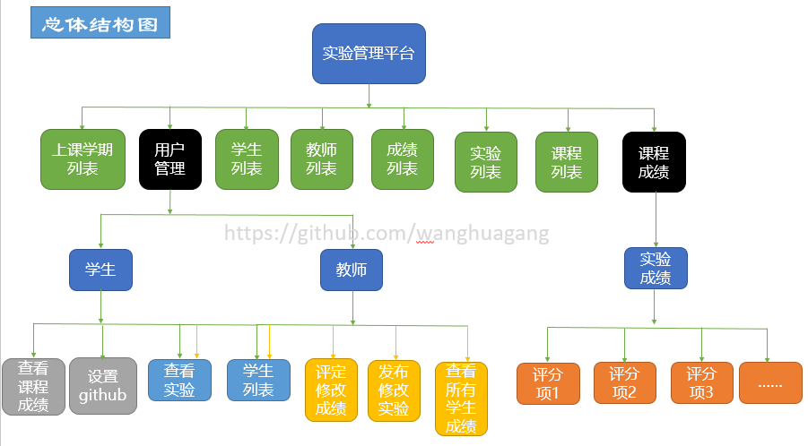
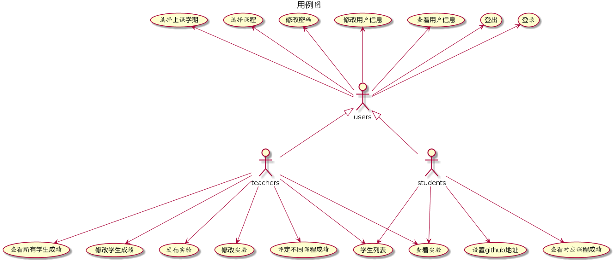
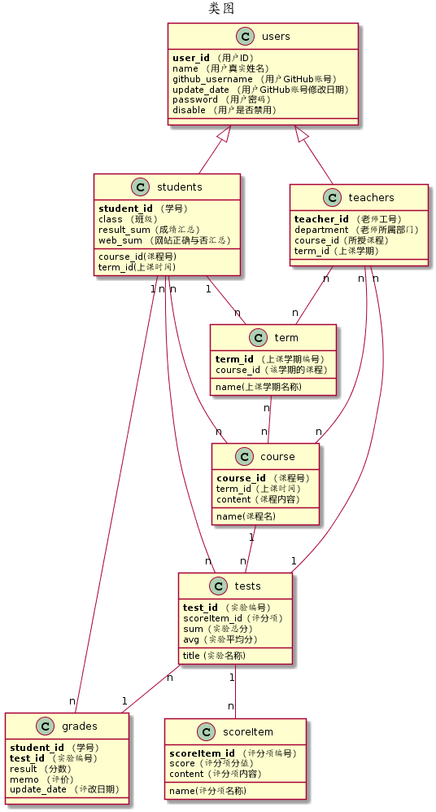

## 1.项目改进

- 用户可以选择所上课的学期。

- 老师和学生可以选择课程。

- 每门课程可以有多个实验，不仅局限于一门课程。

- 每个实验的评分可以由老师设置评分项进行打分，也可以进行评价。

- 每个实验分数由系统自动根据评分项计算得出。

- 每门课程由系统计算各实验分数的平均值进行计算得出。

- 老师和学生都可以查看自己所选或者所授课程的实验成绩情况。

- 学生功能：
    - 登录、登出
    - 选课
    - 修改个人信息
    - 设置github地址
    - 查看实验及实验成绩
    - 查看所选课程信息及课程成绩

- 教师功能：
    - 登录、登出
    - 选课
    - 修改个人信息
    - 发布该课程实验内容及评分项
    - 修改该课程实验内容及评分项
    - 对实验评分项进行打分、评价
    - 查看所有学生实验内容及成绩
    - 修改所有成绩

## 2.系统总体结构图
---

## 3.用例图 [源码](code/用例图.wsd)
---

## 4.类图 [源码](code/类图.wsd)
---

## 5.数据库设计
---

- [数据库详细设计](itemMD/data.md)

## 6.界面设计
---

- [登录界面](image/ui/login.png)

- [设置Github地址界面](image/ui/setGithub.png)

- [选择课程和上课学期界面](image/ui/setCourse.png)

- [查看实验界面](image/ui/searchTest.png)

- [查看实验成绩界面](image/ui/searchGrades.png)

- [查看课程成绩界面](image/ui/searchCourseGrades.png)

- [修改密码界面](image/ui/rePwd.png)

- [发布实验界面](image/ui/publishTest.png)

- [修改实验界面](image/ui/updateTest.png)

- [获取用户信息界面](image/ui/getUserInfo.png)

- [学生获取学生列表界面](image/ui/getStudents2.png)

- [老师获取学生列表界面](image/ui/getStudents.png)

- [评定成绩界面](image/ui/enterGrades.png)

## 7.用例、界面及API综合设计
---

- [学生列表用例](itemMD/yl/students.md)

- [设置github地址用例](itemMD/yl/setGithub.md)

- [选择课程和所上学期用例](itemMD/yl/setCourse.md)

- [查看实验用例](itemMD/yl/searchTest.md)

- [查看成绩用例](itemMD/yl/searchGrades.md)

- [查看课程成绩用例](itemMD/yl/searchCourseGrades.md)

- [修改密码用例](itemMD/yl/rePwd.md)

- [发布实验用例](itemMD/yl/publishTest.md)

- [修改实验用例](itemMD/yl/publishTest.md)

- [登出系统用例](itemMD/yl/loginOut.md)

- [登录系统用例](itemMD/yl/login.md)

- [获取用户信息用例](itemMD/yl/getUserInfo.md)

- [评定成绩用例](itemMD/yl/enterGrades.md)
