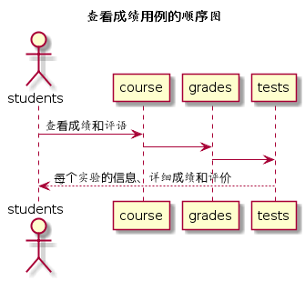

# “查看成绩”用例 [返回](../../README.md)
## 1. 用例规约

|用例名称|查看成绩|
|-------|:-------------|
|功能|学生查看自己的课程对应的每个实验的详细成绩和总分以及实验评价|
|参与者|学生|
|前置条件|学生需要先登录|
|后置条件| |
|主事件流| |
|备选事件流| |

## 2. 业务流程（顺序图） [源码](../hd/searchGrades.wsd)
 

## 3. 界面设计
- 界面参照: [searchCourseGradesUI](../../image/ui/searchGrades.png)
- API接口调用
    - 接口1：[searchCourseGrades](../../api/searchGrades.md) 

## 4. 算法描述
    无
    
## 5. 参照表
- [STUDENTS](../data.md/#STUDENTS)
- [GRADES](../data.md/#GRADES)
- [TESTS](../data.md/#TESTS)
