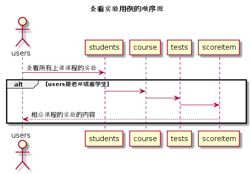

# “查看实验”用例 [返回](../../README.md)
## 1. 用例规约

|用例名称|查看实验|
|-------|:-------------|
|功能|查看各个学生不同课程的各个实验的内容|   
|参与者|学生，老师|
|前置条件|学生和老师需要登录|
|后置条件| |
|主事件流| |
|备选事件流| |

## 2. 业务流程（顺序图） [源码](../hd/searchTest.wsd)
 

## 3. 界面设计
- 界面参照: [searchTestUI](../../image/ui/searchTest.png)
- API接口调用
    - 接口设计：[searchTest](../../api/searchTest.md) 

## 4. 算法描述

- 实验地址返回为列表  
  - 将后台返回的数据进行切分，返回的数据包含test的数组，根据实验名称和实验地址分别存于表格中。
  - 将实验的地址放在a标签中，可点击查看。
    
## 5. 参照表

- [STUDENTS](../data.md/#STUDENTS)
- [TESTS](../data.md/#TESTS)