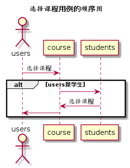

# “选择课程和上课学期”用例 [返回](../../README.md)
## 1. 用例规约

|用例名称|选择课程|
|-------|:-------------|
|功能|用户选择所选的课程和上课学期|   
|参与者|学生、老师|
|前置条件|学生、老师都需要登录，并且老师先选，学生后选|
|后置条件| |
|主事件流| |
|备选事件流| |

## 2. 业务流程（顺序图） [源码](../hd/setCourse.wsd)
 

## 3. 界面设计
- 界面参照: [searchTestUI](../../image/ui/setCourse.png)
- API接口调用
    - 接口设计：[searchTest](../../api/setCourse.md) 

## 4. 算法描述
无
    
## 5. 参照表

- [STUDENTS](../data.md/#STUDENTS)
- [COURSE](../data.md/#COURSE)
