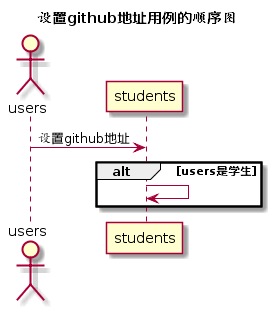

# “设置github地址”用例 [返回](../../README.md)
## 1. 用例规约

|用例名称|设置github地址|
|-------|:-------------|
|功能|学生设置github地址，以便老师查看实验|   
|参与者|学生|
|前置条件|学生需要登录|
|后置条件| |
|主事件流| |
|备选事件流| |

## 2. 业务流程（顺序图） [源码](../hd/setGithub.wsd)
 

## 3. 界面设计
- 界面参照: [searchTestUI](../../image/ui/setGithub.png)
- API接口调用
    - 接口设计：[searchTest](../../api/setGithub.md) 

## 4. 算法描述
无
    
## 5. 参照表

- [STUDENTS](../data.md/#STUDENTS)
